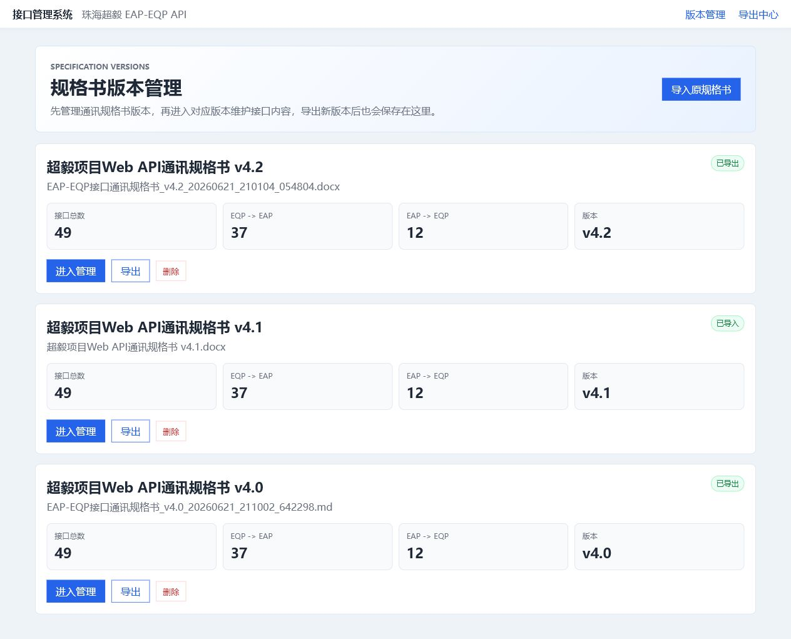
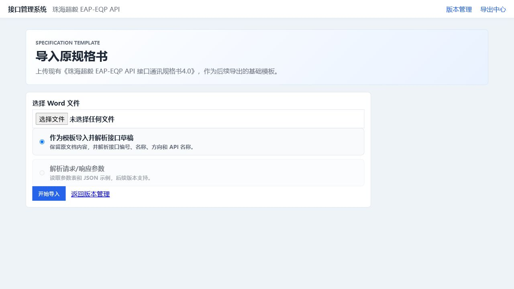
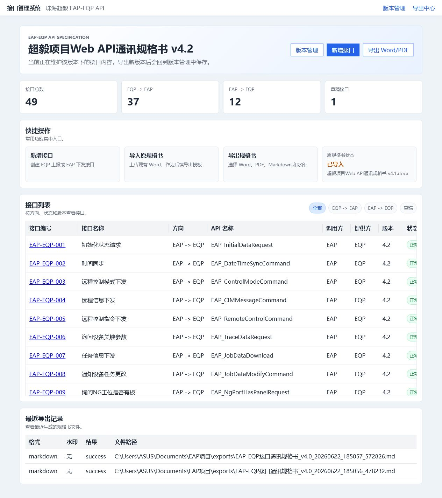
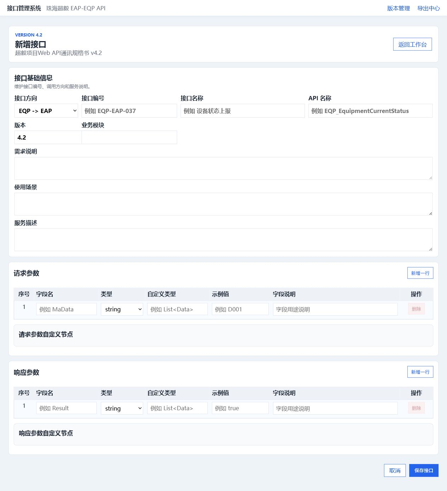
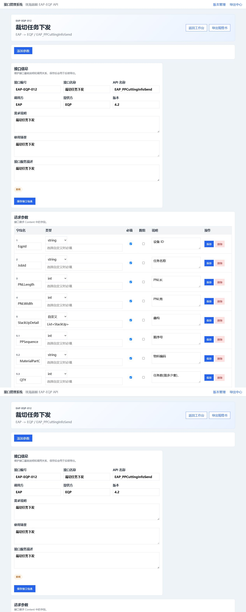
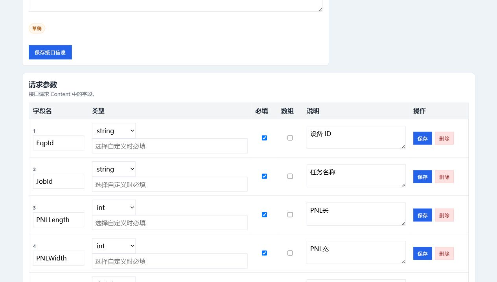
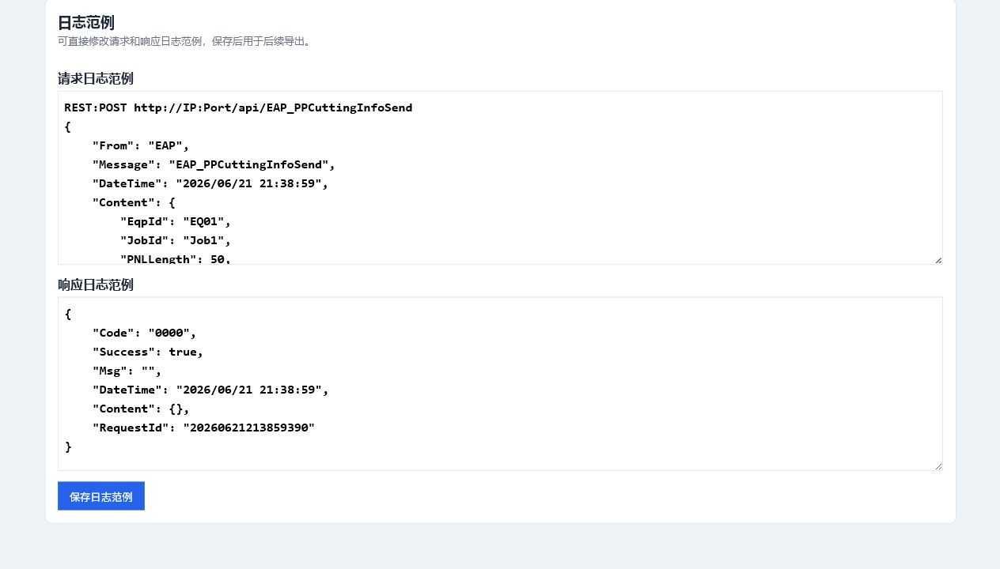
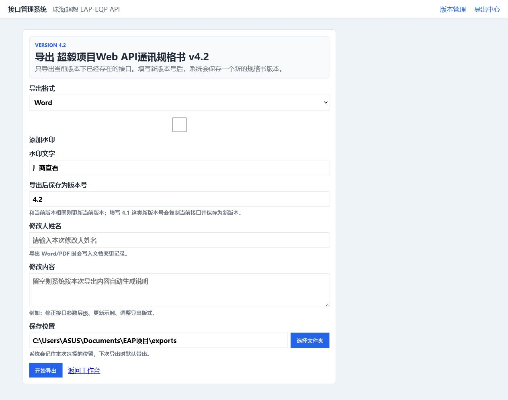

# EAP接口规格书管理系统操作手册

更新日期：2026-06-29

本文档用于指导开发人员和规格书维护人员使用 EAP接口规格书管理系统。后续系统功能更新时，请优先维护本 Markdown 文件，再同步生成 Word 版本。

## 目录

- 1. 系统概述
- 2. 规格书版本管理
- 3. 导入原规格书
- 4. 接口管理工作台
- 5. 新增接口
- 6. 接口详情与参数维护
  - 6.1 请求参数、响应参数与自定义子节点
- 7. 日志范例生成
- 8. 导出规格书
- 9. 服务器部署后的访问方式
- 10. 常见问题

## 1. 系统概述

EAP接口规格书管理系统用于集中维护 EAP 与 EQP 之间的 Web API 通讯规格书。系统支持导入原始 Word 规格书、维护接口与参数、生成日志范例，并导出 Word、PDF 或 Markdown 文档。

系统部署到服务器后，开发人员通过浏览器访问同一个地址，接口数据、版本履历、导出记录和上传模板会统一保存在服务器上。

**要点说明**

- 适用人员：EAP 开发、EQP 对接开发、测试人员、规格书维护人员。
- 推荐访问方式：http://服务器IP:8000。
- 推荐维护原则：先确认当前规格书版本，再进入对应版本维护接口内容。

## 2. 规格书版本管理

进入系统后默认显示规格书版本管理页面。页面按版本从新到旧排列，最新版本在最上方。每个版本卡片展示接口总数、接口方向统计和版本号。

*图 1 规格书版本管理首页*

**操作步骤**

1. 确认需要维护的规格书版本。
2. 点击“进入管理”进入该版本的接口管理页面。
3. 点击“导出”可直接进入该版本的导出中心。
4. 如需导入新的原始规格书，点击“导入原规格书”。

**注意事项**

- 已经导出 Word 或 PDF 的版本会作为正式版本使用。
- 删除版本会同步删除该版本下的接口和参数，操作前需要确认。

## 3. 导入原规格书

导入原规格书用于上传已有 Word 通讯规格书。系统会保存原始模板，并尽量识别文档中的接口基础信息，后续导出 Word 时会基于该模板生成新版规格书。

*图 2 导入原规格书页面*

**操作步骤**

1. 点击顶部或首页中的“导入原规格书”。
2. 选择 .docx 格式的规格书文件。
3. 点击上传，等待系统完成识别。
4. 导入完成后，返回版本管理页面确认版本是否正确。

**注意事项**

- 当前仅支持 .docx 文件。
- 如果原文档格式异常，接口识别可能不完整，需要在接口管理页面手动补充。

## 4. 接口管理工作台

接口管理工作台用于查看当前版本下的所有接口。列表支持按方向和状态筛选，点击接口编号可以进入接口详情页。

*图 3 接口管理工作台*

**操作步骤**

1. 从版本管理页点击“进入管理”。
2. 通过“全部 / EQP -> EAP / EAP -> EQP”筛选接口方向。
3. 通过状态筛选查看草稿或正式接口。
4. 点击接口编号进入接口详情，维护基础信息、参数和日志范例。

**注意事项**

- 接口方向决定调用方和提供方的默认理解。
- 导出 Word 或 PDF 成功后，对应版本接口会更新为正式状态。

## 5. 新增接口

新增接口页面用于一次性录入接口基础信息、请求参数、响应参数和自定义子节点。页面支持按行维护参数，适合新增接口时批量录入字段。

*图 4 新增接口页面*

**操作步骤**

1. 进入目标规格书版本，点击“新增接口”。
2. 填写接口编号、接口名称、接口方向、API 名称、调用方、提供方等基础信息。
3. 在请求参数区域按行新增字段。
4. 在响应参数区域按行新增字段。
5. 如字段类型为自定义对象或 List<自定义对象>，在下方维护对应自定义类型的子节点参数。
6. 确认无误后保存。

**注意事项**

- 接口编号建议保持 EAP-EQP-xxx 或 EQP-EAP-xxx 格式。
- 字段类型建议使用系统下拉选项，例如 string、int、float、double、bool、DateTime、object、array。
- 字段说明较长时页面会自动换行显示，避免内容被截断。

## 6. 接口详情与参数维护

接口详情页用于维护单个接口的完整内容。页面上方是接口基础信息，下方分别维护请求参数、响应参数和日志范例。

*图 5 接口详情页面*

**操作步骤**

1. 进入接口详情后，先确认接口基础信息是否正确。
2. 如需修改接口名称、API 名称、调用方、提供方或接口描述，编辑后保存。
3. 在请求参数或响应参数区域新增、修改、删除字段。
4. 字段调整后，重新生成或检查日志范例。

**注意事项**

- 不要直接在已导出的旧版本上维护新需求，建议基于最新版本导出新版本后再维护。
- 修改参数后要检查日志范例是否同步体现。

### 6.1 请求参数、响应参数与自定义子节点

当某个字段是自定义类型，例如 StackUp 或 List<StackUp>，需要在对应参数区域下方维护自定义类型的子节点参数。导出 Word、PDF 以及生成日志范例时，系统会同步输出这些子节点。

*图 6 参数维护与自定义子节点区域*

**操作步骤**

1. 在参数行中选择自定义类型，并填写自定义类型名称。
2. 在自定义类型模块中新增该类型的字段。
3. 确认子节点字段名称、类型、示例值和说明。
4. 保存后检查参数编号和日志范例。

**注意事项**

- 同一个自定义类型可以包含多个子节点字段。
- 如果请求参数和响应参数都有自定义类型，需要分别维护。

## 7. 日志范例生成

日志范例用于给开发和测试人员快速确认接口请求、响应结构。系统会根据接口参数生成请求日志和响应 JSON 示例。

*图 7 日志范例区域*

**操作步骤**

1. 完成接口基础信息和参数维护。
2. 进入接口详情页底部查看请求日志范例和响应日志范例。
3. 检查 RequestId、DateTime、字段类型和自定义子节点是否符合预期。
4. 如参数变更，保存后重新检查日志范例。

**注意事项**

- 新增接口中的 RequestId 会按当前时间生成 17 位唯一标识格式。
- 自定义子节点参数应同步体现在日志范例中。

## 8. 导出规格书

导出中心支持导出 Markdown、Word、PDF、Word + PDF。导出 Word 或 PDF 成功后，系统会记录导出版本，并将对应版本接口状态更新为正式。

*图 8 导出中心*

**操作步骤**

1. 进入需要导出的规格书版本。
2. 点击“导出 Word/PDF”或版本卡片中的“导出”。
3. 选择导出格式。
4. 填写目标版本、修改人姓名和修改内容。
5. 选择或确认保存路径。
6. 点击导出，等待系统生成文件。

**注意事项**

- 如果目标版本与当前版本一致，导出文件会归档到当前版本。
- 如果目标版本是新版本，系统会复制当前版本接口到新版本。
- 导出 Word 或 PDF 成功后，草稿接口会变为正式状态。

## 9. 服务器部署后的访问方式

系统部署在服务器后，所有开发人员通过同一个服务器地址访问。数据库、导出文件和上传模板统一保存在服务器目录。

**要点说明**

- 服务器本机访问：http://127.0.0.1:8000。
- 其他电脑访问：http://服务器IP:8000。
- 数据库位置：C:\EAPSystem\data\interface_manager.db。
- 导出文件位置：C:\EAPSystem\exports。
- 上传模板位置：C:\EAPSystem\uploads。

**注意事项**

- 如果其他电脑无法访问，优先检查服务器防火墙是否放行 8000 端口。
- 如果尚未安装为 Windows 服务，运行系统的 PowerShell 窗口不能关闭。

## 10. 常见问题

**本机能打开，其他电脑打不开怎么办？**

确认其他电脑使用的是服务器 IP，而不是 127.0.0.1；同时检查服务器防火墙是否放行 8000 端口。

**导入 Word 后接口识别不完整怎么办？**

先确认原 Word 格式是否规范；未识别的接口可以在对应版本中手动新增或补充。

**修改参数后日志范例没有变化怎么办？**

确认参数已保存，并刷新接口详情页；自定义类型需要同时维护子节点字段。

**导出后为什么接口状态变成正常？**

这是正式导出规则。Word 或 PDF 导出成功后，代表该版本已形成可发布文档，接口状态会更新为正式。

**数据应该如何备份？**

重点备份 C:\EAPSystem\data\interface_manager.db，同时备份 uploads 和 exports 目录。
